# Fireflow — Hack The Box Walkthrough

> **Status:** Completed  
> **Platform:** Hack The Box  
> **Machine:** Fireflow  
> **Difficulty:** Medium  
> **Operating System:** Linux  
> **Machine State:** Retired

## Overview

**Fireflow** is a Linux machine whose attack path moves through several distinct trust boundaries: external web enumeration, Langflow code execution, local credential reuse, an MCP registry authorization flaw, Kubernetes service-account abuse, and finally kubelet access to a privileged monitoring container with the host filesystem mounted inside it.

This writeup is based on the commands and screenshots captured during the actual solve. Flags, passwords, secret keys, JWTs, Kubernetes service-account tokens, and other reusable authentication material are intentionally omitted or redacted.

## High-Level Attack Path

```text
fireflow.htb
    ↓
flow.fireflow.htb
    ↓
Langflow 1.8.2
    ↓
Unauthenticated public-flow code execution
    ↓
www-data
    ↓
Langflow service credential exposure
    ↓
Credential reuse → nightfall
    ↓
MCP registry credentials
    ↓
JWT alg:none authorization bypass
    ↓
Admin-only custom tool registration
    ↓
Arbitrary Python execution in MCP pod
    ↓
Kubernetes service-account enumeration
    ↓
get nodes/proxy RBAC permission
    ↓
Kubelet pod enumeration
    ↓
Privileged node-exporter container
    ↓
Root command execution in container
    ↓
Host filesystem mounted at /host/root
    ↓
Host root proof
```

## 1. Initial Enumeration

### 1.1 Network and Service Enumeration

An initial Nmap scan identified a small external attack surface. The two directly reachable services were SSH on TCP/22 and HTTPS on TCP/443. Nmap also reported several higher ports as filtered rather than directly reachable.

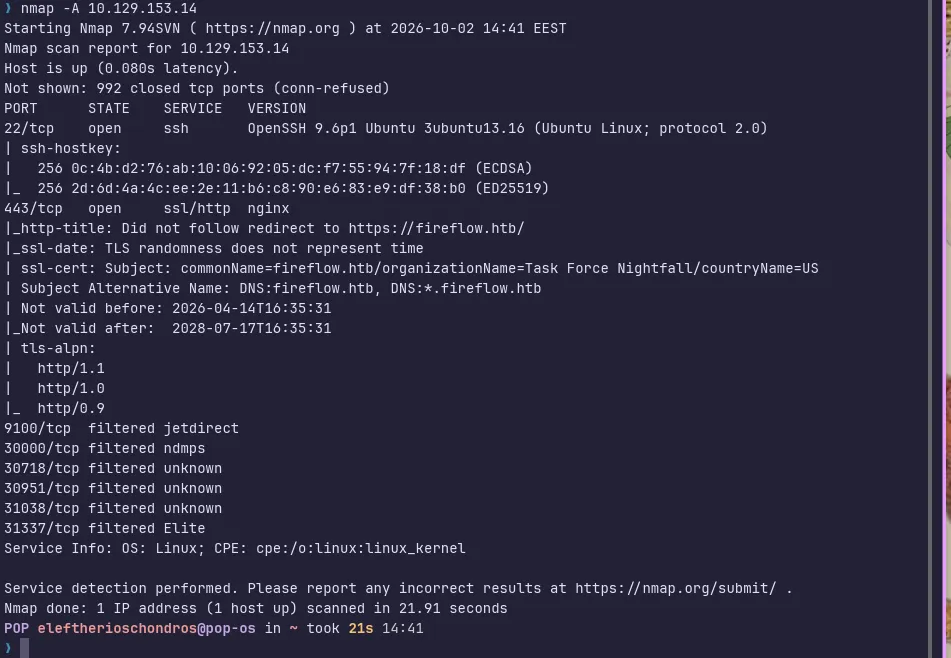

TLS inspection provided the first hostname clue. The certificate used `fireflow.htb` and included a wildcard SAN for `*.fireflow.htb`.

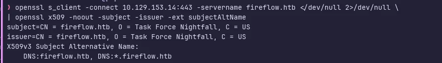

Direct HTTPS access by IP did not produce the application normally, while requests using the expected hostname were redirected appropriately. This established that hostname/SNI-aware routing mattered for the target.

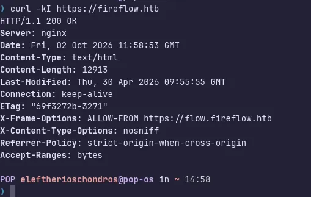

### 1.2 Virtual-Host Discovery

The main Fireflow page exposed an **Open Agent** link. The link pointed to a second virtual host, `flow.fireflow.htb`, and included a public flow identifier in the playground URL.


That second hostname was added to local name resolution and opened in the browser.

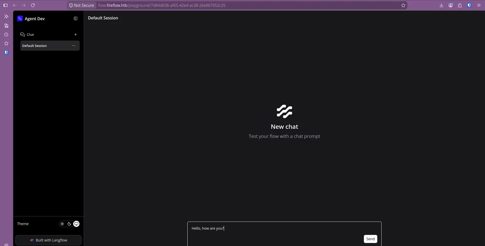

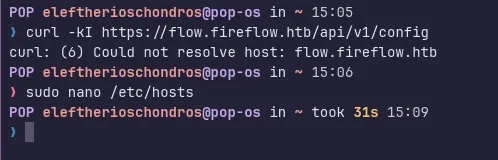

## 2. Application Enumeration

The flow application exposed a version endpoint:

```bash
curl -sk https://flow.fireflow.htb/api/v1/version
```

The backend identified itself as **Langflow 1.8.2**.

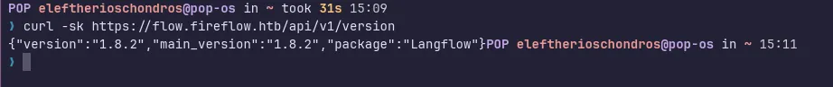

The combination of a vulnerable Langflow version and an exposed public flow identifier provided the prerequisites for the initial access path.

## 3. Initial Access

Vulnerability research against the exposed Langflow version identified an unauthenticated code-execution path in the public-flow build functionality. A public proof-of-concept was prepared for the discovered flow.

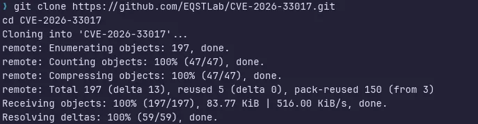

The first exploitation attempts reached the vulnerable endpoint but required troubleshooting the callback path and HTTPS certificate handling.

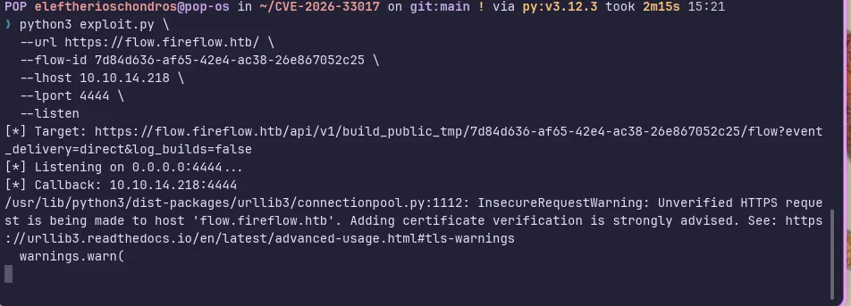

A reverse connection was eventually received from the target, producing a shell as the web-service account:

```text
www-data@fireflow:/var/lib/langflow$
```

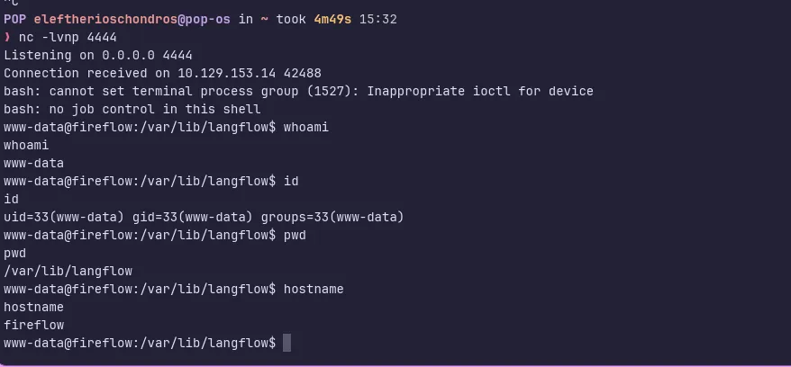

The exploit HTTP request itself could time out while the reverse-shell path was executing; packet capture confirmed that the target was attempting the callback during troubleshooting.

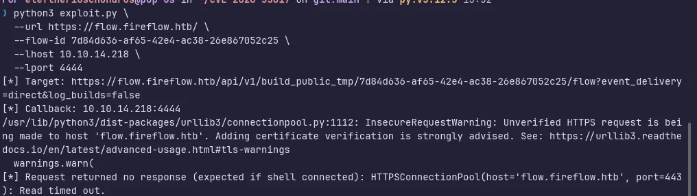

## 4. Local Enumeration

The Langflow process environment exposed sensitive application configuration, including a service secret, a configured superuser, and a plaintext superuser password. Those values are redacted in the published evidence.

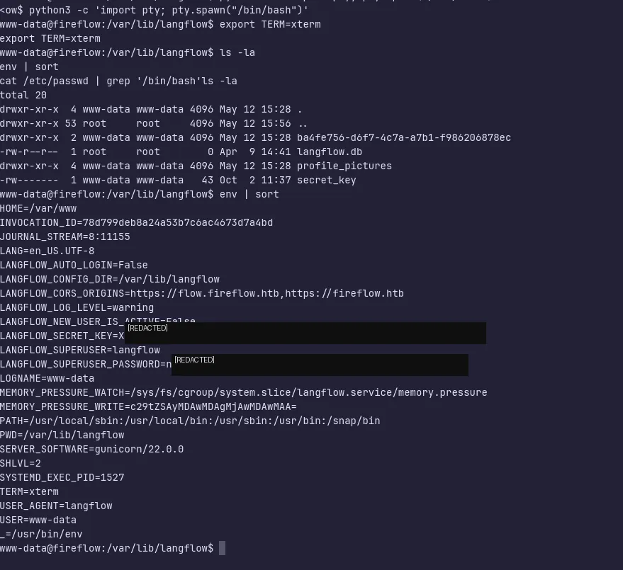

Local account enumeration showed that `nightfall` was the only non-root interactive user.

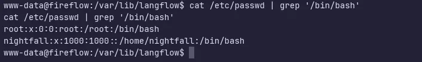

The application credential was reused by the local `nightfall` account, allowing a transition from the web-service context to a normal system-user shell.

## 5. User Access — nightfall

Enumeration of Nightfall's home directory revealed both the user proof and a hidden `.mcp` directory.

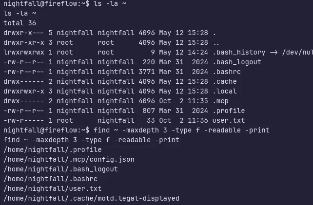

The user proof was retrieved successfully; its value is intentionally redacted.

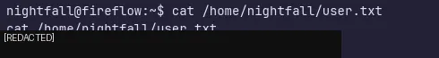

A check of `sudo -l` did not reveal a useful sudo-based escalation path, so attention shifted to the MCP configuration and Kubernetes-related services visible on the host.

## 6. Privilege Escalation

### 6.1 MCP Registry Discovery

Nightfall's MCP configuration identified an **MCP AI Tool Registry** and a dedicated application account. The recovered password is redacted from the screenshot and omitted from this repository.

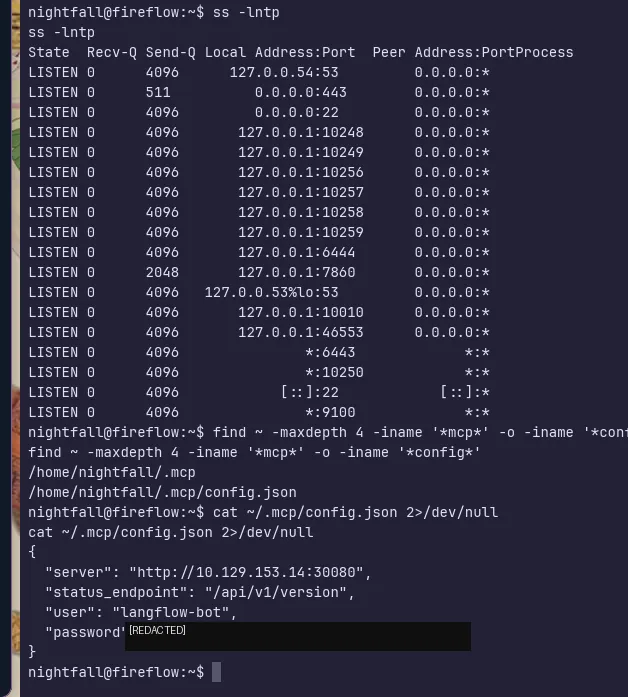

The registry's version endpoint advertised JWT authentication with support for both `HS256` and `none`. Authenticating normally showed a token payload containing a user role. Because the service accepted `alg: none`, the same subject could be preserved while replacing the role with `admin` in an unsigned JWT.

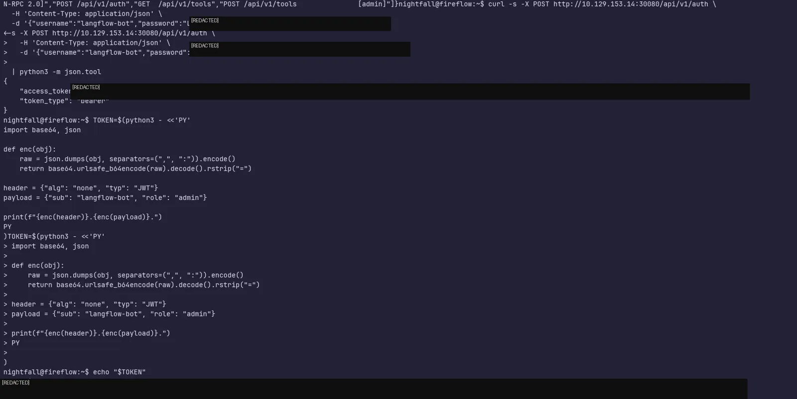

### 6.2 Admin Tool Registration and MCP Code Execution

The forged admin token allowed access to the administrative tool-registration endpoint. A custom tool was registered successfully.

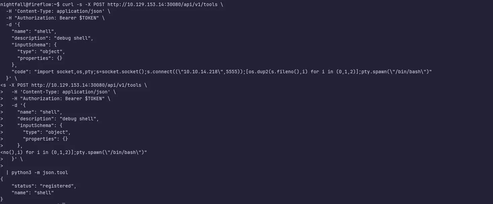

The registered tool was then invoked through MCP JSON-RPC.

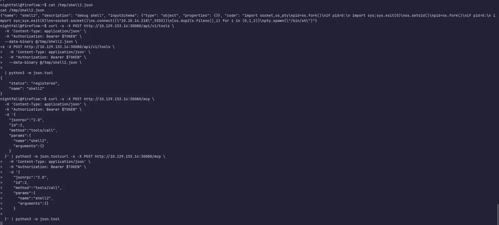

A successful HTTP 200 registration response confirmed the administrative primitive.

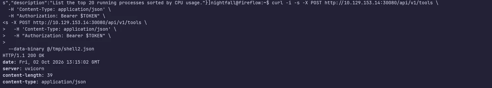

Because the tool registry was backed by multiple runtime instances, registration and invocation were performed through a persistent HTTP session so both requests reached the same backend. A benign execution probe confirmed arbitrary Python execution as the `mcp` account inside a Kubernetes pod.

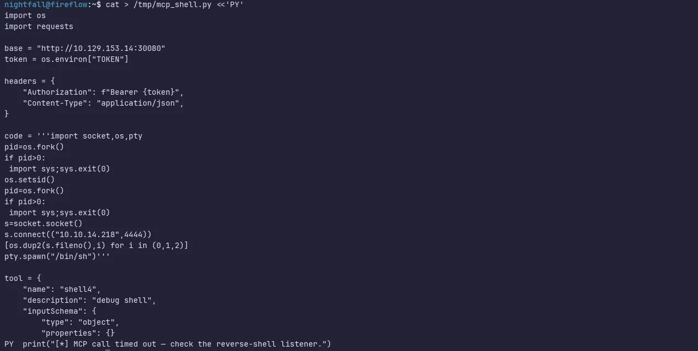

### 6.3 Kubernetes Service Account and RBAC

The MCP pod contained the standard projected Kubernetes service-account mount. A `SelfSubjectRulesReview` showed a narrowly scoped but dangerous permission:

```text
verbs:      ["get"]
apiGroups:  [""]
resources:  ["nodes/proxy"]
```

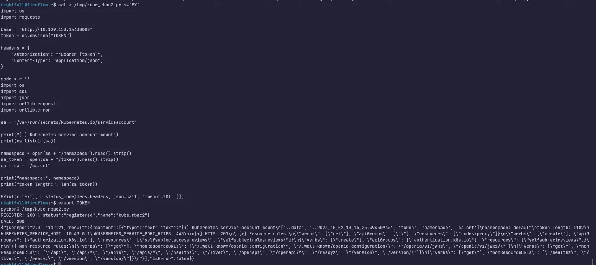

The `nodes/proxy` permission allowed requests to be proxied through the Kubernetes API server to kubelet endpoints on the node.

Kubelet pod enumeration identified the Prometheus node-exporter workload in the `monitoring` namespace. Its container was privileged, ran as UID 0, and mounted host paths including:

```text
/proc  → /host/proc
/sys   → /host/sys
/      → /host/root
```

Direct kubelet execution in the `node-exporter` container confirmed a root execution context. Since the host root filesystem was mounted at `/host/root`, host root-owned files were readable from the container namespace.

The final host proof was retrieved successfully and accepted by Hack The Box. Its value is redacted below and is not included elsewhere in the repository.

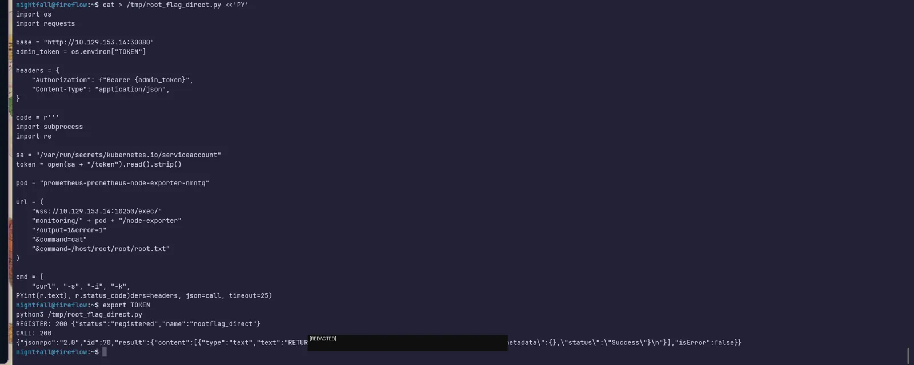

## 7. Attack Chain Summary

```text
fireflow.htb
→ flow.fireflow.htb / Langflow 1.8.2
→ public-flow code execution
→ www-data
→ plaintext Langflow credential exposure
→ credential reuse as nightfall
→ MCP registry credentials
→ unsigned JWT accepted with role=admin
→ custom MCP tool registration
→ code execution as mcp in Kubernetes
→ service-account RBAC: get nodes/proxy
→ kubelet pod enumeration
→ privileged node-exporter container
→ root command execution
→ host filesystem via /host/root
→ host root proof
```

## 8. Security Lessons

- Application process environments should not expose reusable plaintext credentials.
- Credential reuse can turn an application compromise into direct system-user access.
- Accepting JWT `alg: none` defeats the purpose of signature-based authorization.
- Administrative extension systems that execute supplied code are high-risk trust boundaries.
- Kubernetes permissions that appear narrow can still be dangerous; `nodes/proxy` can expose kubelet functionality.
- Privileged monitoring containers with hostPath mounts substantially weaken container isolation.
- A read-only host-root mount remains highly sensitive when a container process can execute as root.
- Layered weaknesses can compose into full host compromise even when no individual intermediate step immediately grants host root.

## Evidence Index

A full evidence map is available at [`notes/EVIDENCE_INDEX.md`](notes/EVIDENCE_INDEX.md).

## Disclaimer

This walkthrough documents work performed in an **authorized Hack The Box environment**.  
Flags, credentials, private keys, JWTs, Kubernetes service-account tokens, VPN profiles, and other sensitive recovered values are intentionally omitted or redacted.
